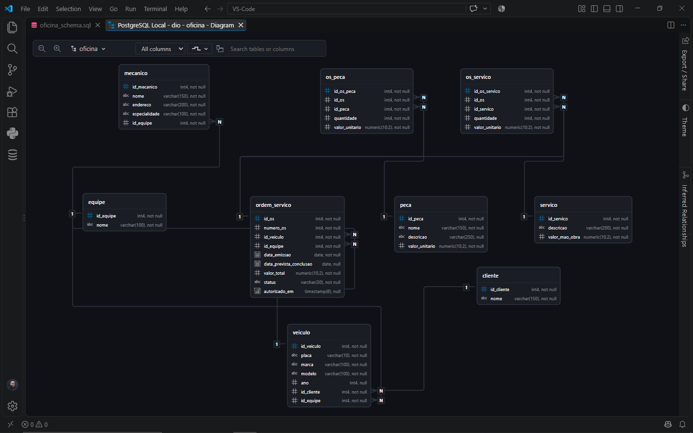

# Projeto Oficina Mecânica — Modelagem de Banco de Dados

Projeto desenvolvido como parte do desafio da DIO **"Construindo um Esquema Conceitual para Banco de Dados"**.

O objetivo é criar um modelo de banco de dados para um sistema de controle e gerenciamento da execução de ordens de serviço em uma oficina mecânica.

## Objetivo

O sistema permite representar:

- Clientes e seus veículos;
- Equipes de mecânicos;
- Mecânicos e suas especialidades;
- Ordens de serviço;
- Serviços realizados;
- Peças utilizadas nas ordens de serviço.

## Modelo de dados

O banco foi implementado em PostgreSQL utilizando o schema `oficina`.

Principais entidades:

- `cliente`
- `veiculo`
- `equipe`
- `mecanico`
- `ordem_servico`
- `servico`
- `peca`
- `os_servico`
- `os_peca`

### Relacionamentos

- Um cliente pode possuir vários veículos.
- Uma equipe pode ser responsável por vários veículos.
- Uma equipe pode possuir vários mecânicos.
- Um veículo pode possuir várias ordens de serviço.
- Uma equipe pode executar várias ordens de serviço.
- Uma ordem de serviço pode possuir vários serviços.
- Uma ordem de serviço pode utilizar várias peças.

Os relacionamentos muitos-para-muitos entre `ordem_servico` e `servico`, e entre `ordem_servico` e `peca`, foram resolvidos por meio das tabelas associativas `os_servico` e `os_peca`.

## Decisões de modelagem

A equipe responsável pelo veículo e a equipe responsável pela ordem de serviço são armazenadas separadamente.

Dessa forma, o modelo permite preservar a equipe responsável por uma determinada ordem de serviço mesmo que a equipe atualmente associada ao veículo seja alterada posteriormente.

Também foi incluído o campo `autorizado_em` na ordem de serviço para representar o momento em que o cliente autorizou a execução dos serviços.

## Tecnologias utilizadas

- PostgreSQL
- SQL
- VS Code
- DBCode

## Diagrama

